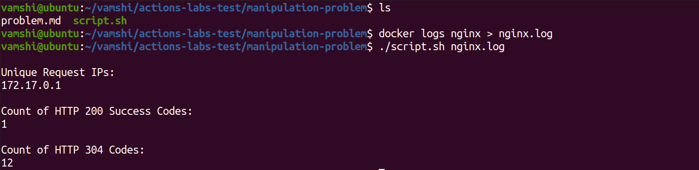
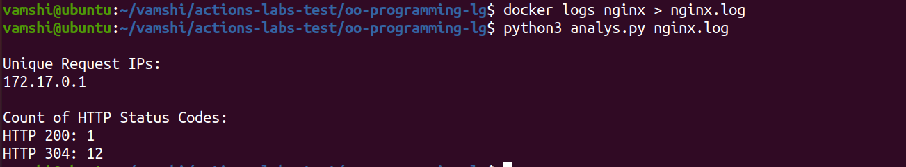
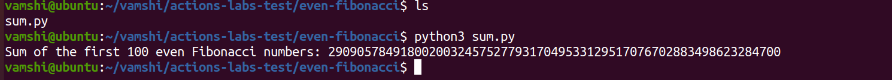
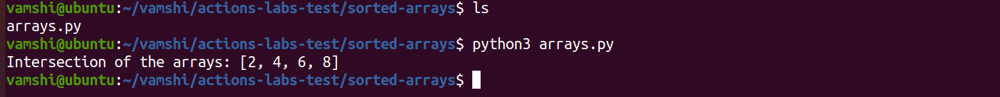
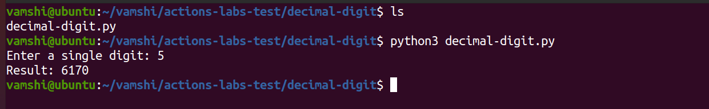

# Dockerfile for nginx 1.19:

Created a Dockerfile , you can get file inside `nginx-dockerfile` folder
Used base image is `ubuntu:20.04`

used this site to download nginx packages 

Ref: [https://nginx.org/en/linux_packages.html#Ubuntu]

`Note:`                        
  Added `default.conf` because after building i tested container , no logs are showed , so i added that file to replace default one

**Security test**

Used trivy tool to test the image, the result of securty test image will be available inside `images` folder

# Kubernetes StatefulSet:

Inside `k8s-sts` folder the  manifest file and also tested this in minikube cluster
   

# Build a Deployment Pipeline

Here i am used jenkins, the Jenkinsfile is inside `deployment-pipeline` folder

# Text Manipulation Problem

For this i am using nginx logs, we generate a custom nginx images using that image i ran container and make some pai requests and the capture those logs and fetch some importatnt details

you will get script and problem statement inside `manipulation-problem`

# Text Manipulation with an Object Orientated Programming Language

Here i am using python to manipulate nginx logs , you will get python file inside folder `oo-programming-lg`

# Sum of Even Fibonacci Numbers:

Here again i am using python only , the python file is available inside folder `even-fibonacci`

# Intersection of Sorted Arrays

Here again i am using python only , the python file is available inside folder `sorted-arrays`

# Decimal Digit Transformation:

Here again i am using python only , the python file is available inside folder `decimal-digit`

