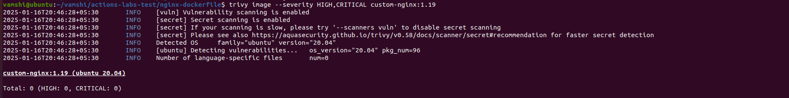
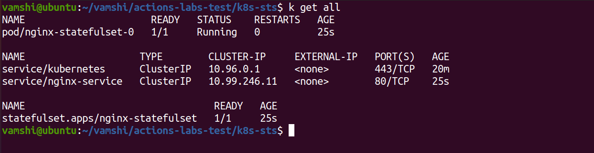

# Dockerfile for nginx 1.19:

Created a Dockerfile , you can get file inside `nginx-dockerfile` folder
Used base image is `ubuntu:20.04`

Ref[https://github.com/vamshisunkari1/actions-labs-test/blob/main/nginx-dockerfile/Dockerfile]
used this site to download nginx packages 

Ref: [https://nginx.org/en/linux_packages.html#Ubuntu]

`Note:`                        
  Added `default.conf` because after building i tested container , no logs are showed , so i added that file to replace default one

**Security test**

Used trivy tool to test the image, the result of securty test image will be available inside `images` folder

# Kubernetes StatefulSet:

Inside `k8s-sts` folder the  manifest file and also tested this in minikube cluster
   
Ref: [https://github.com/vamshisunkari1/actions-labs-test/blob/main/k8s-sts/statefullset.yaml]

# Build a Deployment Pipeline

Here i am used jenkins, the Jenkinsfile is inside `deployment-pipeline` folder

